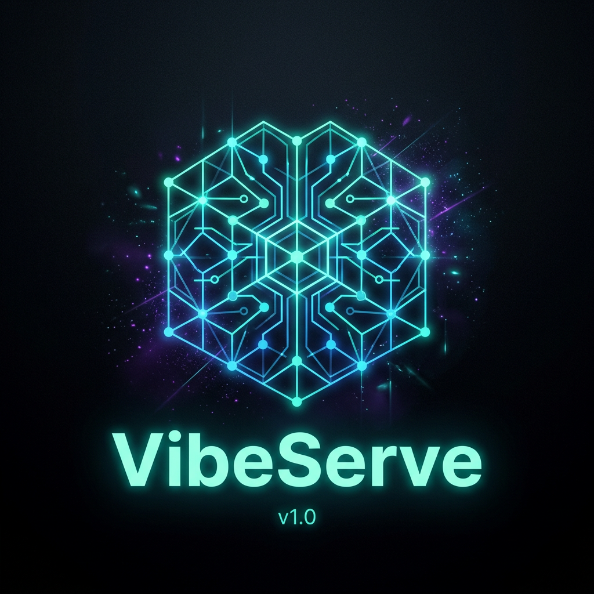
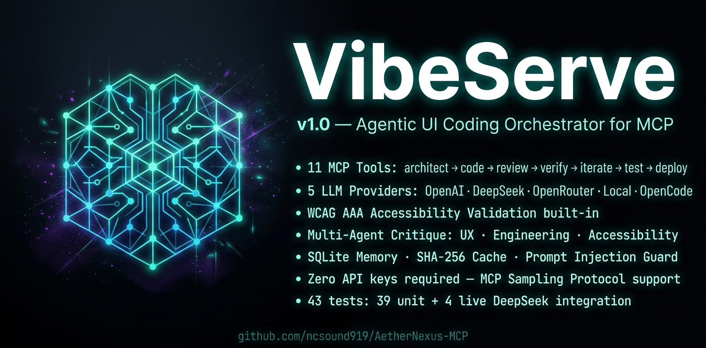

#  VibeServe v1.0

> **The Agentic UI Coding Orchestrator for the Model Context Protocol**

[](https://github.com/ncsound919/VibeServe-MCP/actions/workflows/ci.yml)
[](https://python.org)
[](https://modelcontextprotocol.io)
[](https://www.w3.org/TR/WCAG21/)
[](LICENSE)
[](#)
[](#)

---

## What is VibeServe?

VibeServe is a production-grade MCP server that turns natural language intent into fully-architected, accessible, production-ready UI code — through a 7-step agentic pipeline powered by your choice of LLM.

Drop it into **Claude Desktop**, **Cursor**, **Windsurf**, or any MCP-compatible client and start building.

---

## The Vibe Pipeline

```
🏗️ vibe_architect → 💻 vibe_code → 🔍 vibe_review → ✅ vibe_verify → 🔄 vibe_iterate → 🧪 vibe_test → 🚀 vibe_deploy
```

Each step is an independent MCP tool. Chain the full pipeline or call any step standalone.

---

## Key Features

- **13 MCP Tools** — Full pipeline from architecture to deployment
- **5 LLM Providers** — OpenAI, DeepSeek, OpenRouter, Local (Ollama), OpenCode CLI — with automatic fallback
- **MCP Sampling** — Works with zero API keys via the client's own LLM
- **WCAG AAA** — Accessibility validation built into every generation step
- **Multi-Agent Critique** — UX Designer, Frontend Engineer, and Accessibility Advocate review in parallel
- **SQLite Memory Store** — Learns from high-scoring specs across sessions
- **SHA-256 Cache** — Tamper-resistant filesystem cache with TTL
- **Prompt Injection Guard** — `_sanitize_input()` strips injection patterns before every LLM call
- **43 Tests** — 39 unit + 4 live DeepSeek integration tests, all passing

---

## Frontend Visual

<p align="center">
  
</p>
- **Docker Support** — `Dockerfile` + `docker-compose.yml` included

---

## Quickstart

```bash
git clone https://github.com/ncsound919/VibeServe-MCP
cd VibeServe-MCP
pip install -e ".[dev]"
cp .env.example .env  # add your API keys, or leave blank for local/sampling
```

**Claude Desktop** (`claude_desktop_config.json`):
```json
{
  "mcpServers": {
    "vibeserve": {
      "command": "python",
      "args": ["/path/to/VibeServe-MCP/vibeserve.py"]
    }
  }
}
```

**Run tests:**
```bash
pyproject.toml pytest test_aether_nexus.py test_integration_v5.py test_integration_real_api.py -v
```

---

## All 13 MCP Tools

| Tool | Description |
|------|-------------|
| `vibe_architect` | Natural language → full architecture plan with ADR decisions |
| `vibe_code` | Architecture plan → production TypeScript/JSX code files |
| `vibe_review` | 3-agent parallel code review (UX · Engineering · Accessibility) |
| `vibe_verify` | Static validation: WCAG, UISchema, ARIA, code quality |
| `vibe_iterate` | Critique → repair → re-evaluate loop (up to N iterations) |
| `vibe_test` | Generate full test suites from source code |
| `vibe_deploy` | Generate Vercel, Docker, and Node.js deployment configs |
| `generate_ui_spec` | V4: multi-agent UI spec generation with design system enforcement |
| `validate_ui_spec` | Validate any UISchema v1.0 document |
| `list_design_systems` | List available design systems and token palettes |
| `memory_stats` | Stats on the SQLite-backed spec memory store |

---

## Architecture

See **[docs/index.html](https://ncsound919.github.io/VibeServe-MCP)** for the full interactive architecture page.

Quick overview:
```
MCP Client (Claude Desktop / Cursor / Windsurf)
       ↓ MCP Protocol
VibeServe FastMCP Server
  ├── 13 Tools · 5 Resources · 6 Prompts · SamplingProvider
  ├── V5 Agentic Pipeline (Architect → Implement → Review → Verify → Iterate → Test → Deploy)
  ├── LLMRouter (OpenAI · DeepSeek · OpenRouter · Local · OpenCode + auto-fallback)
  ├── MemoryStore (SQLite, indexed by page_type + score)
  ├── CacheManager (SHA-256 integrity + TTL)
  └── SchemaValidator (UISchema v1.0 + WCAG AAA)
```

---

## LLM Providers

| Provider | Model | Requires |
|----------|-------|----------|
| OpenAI | gpt-4-turbo-preview | `OPENAI_API_KEY` |
| DeepSeek | deepseek-chat | `DEEPSEEK_API_KEY` |
| OpenRouter | claude-3.5-sonnet (default) | `OPENROUTER_API_KEY` |
| Local | llama3.2 (Ollama) | Ollama running locally |
| OpenCode CLI | opencode/hy3-preview-free | `npm install -g opencode-ai` |
| **SamplingProvider** | *(client's LLM)* | **Nothing — zero config** |

---

## Donate

VibeServe is free and open source. If it saves you time:

**💚 CashApp: `$helptools`**

Every dollar helps keep the tools free.

---

## License

MIT — see [LICENSE](LICENSE)

---

*Built with 🖤 · VibeServe v1.0 · [GitHub Pages](https://ncsound919.github.io/VibeServe-MCP)*
